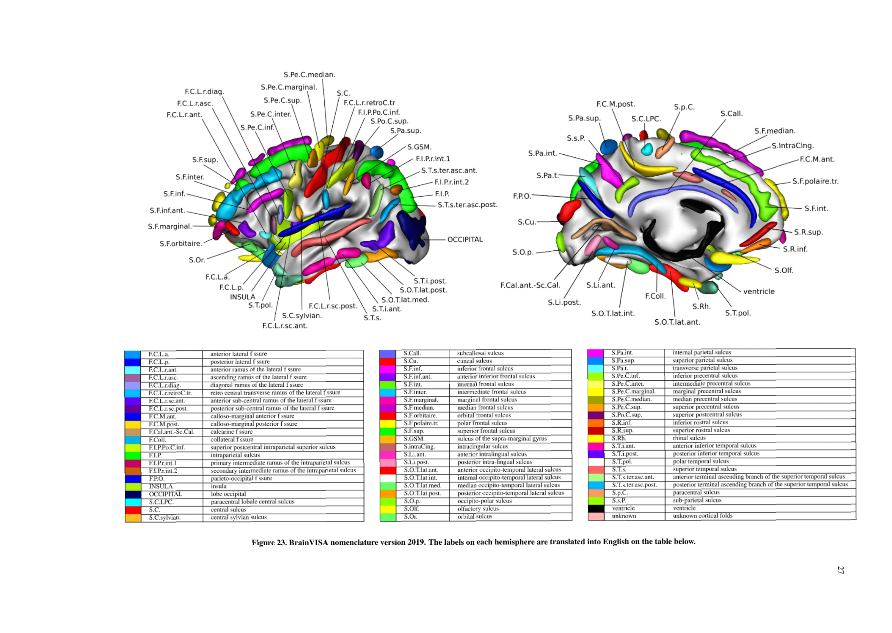

# Project Description

<!-- Add a short paragraph describing the project. -->

We are rewritting the entire epiSTIM toolbox (for [SEEG procedures](https://en.wikipedia.org/wiki/Stereoelectroencephalography)) as a 3D Slicer Extension and adding additional features requested by the clinicians. One of them is the import of labelled sulcis from T1 Morphologist (in Brainvisa Toolbox). To procced, first we need to create a Terminologie for the sulci (and a cbtl? )

## Objective

<!-- Describe here WHAT you would like to achieve (what you will have as end result). -->

1. Create the new terminology for sulci
2. Import the sulci Segmentation (from BrainVisa T1 Morphologist Pipeline )  associating a new Teminology

## Approach and Plan

<!-- Describe here HOW you would like to achieve the objectives stated above. -->

1. Find a official or Standard Terminology/Ontology of brain sulci
2. Create the 3D Slicer Terminology
3. Associate the Terminology to the objects imported from T1 Morphologist

## Progress and Next Steps

<!-- Update this section as you make progress, describing of what you have ACTUALLY DONE.
     If there are specific steps that you could not complete then you can describe them here, too. -->

1. Describe specific steps you **have actually done**.

# Illustrations

<!-- Add pictures and links to videos that demonstrate what has been accomplished. -->

# Background and References

<!-- If you developed any software, include link to the source code repository.
     If possible, also add links to sample data, and to any relevant publications. -->
[Morphologist Pipeline](https://brainvisa.info/web/morphologist.html)

[BrainInfo Ontology API](http://braininfo.rprc.washington.edu/nnont.aspx)

[How to create 3D Slicer Terminologies](https://github.com/lassoan/SlicerMONAIAuto3DSeg/blob/main/UsingStandardTerminology.md)

[SNOMED-CT, DICOM use it](https://browser.ihtsdotools.org/?perspective=full&conceptId1=279348008&edition=MAIN/2024-06-01&release=&languages=en)

[UBERON (multi especes ontology)](https://obophenotype.github.io/uberon/current_release/)

_No response_

