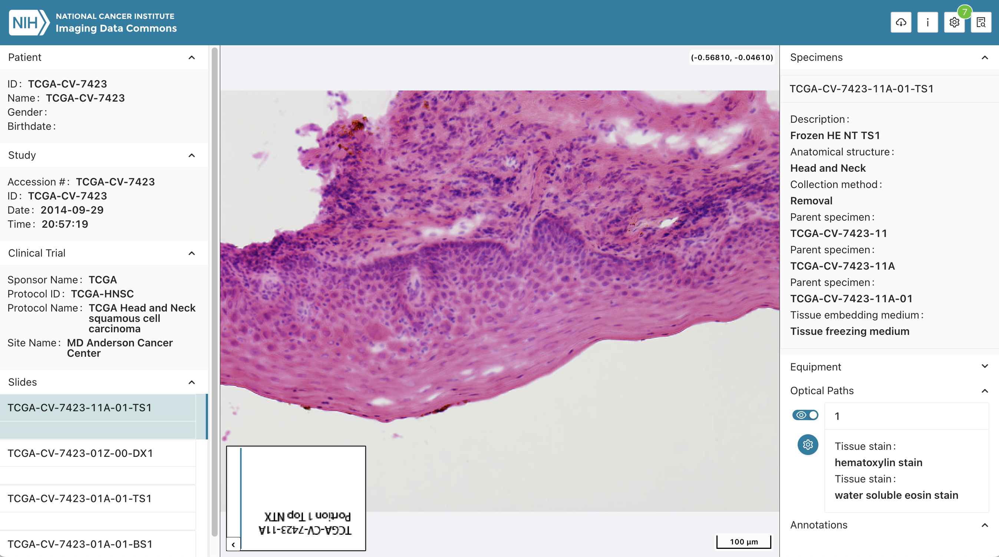

# Project Description

<!-- Add a short paragraph describing the project. -->


DICOM standard is gaining acceptance in digital pathology imaging. Conversion of slide images into DICOM format can make the data more FAIR, improve quality and comprehensiveness of the associated metadata, and improve their interoperability with the commercial and open source tools implementing the standard. 

DICOM format is used for slide microscopy images available in NCI Imaging Data Commons (IDC). Images submitted to IDC in the vendor-specific formats must be converted into DICOM representation, which is currently done using the PixelMed Toolkit based scripts available in [https://github.com/ImagingDataCommons/idc-wsi-conversion](https://github.com/ImagingDataCommons/idc-wsi-conversion).

Our goal is to migrate the DICOM WSI conversion to use community-supported open source tools. Based on our current assessment and experience, [imi-bigpicture/wsidicomizer](https://github.com/imi-bigpicture/wsidicomizer/) is the most promising tools available for this task. In this project we will work on evaluating this tool.


## Objective

<!-- Describe here WHAT you would like to achieve (what you will have as end result). -->


1. Assemble inventory of the publicly available test samples representative of the variety of data encountered by IDC and perhaps outside of IDC.
2. Document requirements for the conversion tool based on the needs of IDC.
3. Complete evaluation of `wsidicomizer` and document the results (in terms of the features and performance of the conversion process).
4. Document results and identified gaps to help with the next steps.


## Approach and Plan

<!-- Describe here HOW you would like to achieve the objectives stated above. -->


1. Select representative source images in the original format and the results of conversion to DICOM available in IDC (as converted using PixelMed Toolkit), as a reference. Assemble information about the characteristics of those samples in a document (vendor, compression, ...). Include the accompanying tabulated metadata that is needed for converting each particulare sample.
2. Requirements: initialization of metadata, standard compliance of the result, transfer of ICC profile, acceptable performance .... (intentionally, DICOM-TIFF dual personality at this point is not a requirement)
3. Create a publicly available script/notebook that performs conversion.
4. Evaluate the results and summarize in a publicly available document.
5. Document any identified problems by opening issues in the `wsidicomizer` repo.


## Progress and Next Steps

1. Set up conversion code in python (simple), confirmed conversion approach is consistent between what we use in IDC and what Max is using in Kaapana (`wsidicomizer` Python function - not command line tool).
2. Prepared queries for selecting test images from IDC. Mapping to the source file in vendor format is stored in a private tag `(0009,1001)` (source non-DICOM files are in private buckets in IDC).
3. Identified problems in selecting samples based on `TransferSyntaxUID` - did not realize initially it can vary across instances within the same series!
4. Identified numerous very strange images in IDC - will need to investigate this further.
5. Started testing `wsidicomizer`, tested with JPEG and uncompressed samples.
6. Identified and reported converter issues, several of which have already been resolved (kudos to Erik Gabrielsson, `wsidicomizer` maintainer!):
  * https://github.com/imi-bigpicture/wsidicomizer/issues/117
  * https://github.com/imi-bigpicture/wsidicomizer/issues/118
  * https://github.com/imi-bigpicture/wsidicomizer/issues/123
6. Discussed various issues related to conversion and shared experience; reached agreement `wsidicomizer` is the best choice given combined experience, and very good support from Erik.
7. Identified issues in `dicom3tools` building it in Colab VM - fixed by David Clunie (link to the final notebook to be shared later).

Query for selecting samples from IDC based on `TransferSyntaxUID` applied to the base layer of the image pyramid:

```sql
  #select TotalPixelMatrixColumns from `bigquery-public-data.idc_current.dicom_all`
WITH
  RankedRows AS (
  SELECT
    SeriesInstanceUID,
    StudyInstanceUID,
    TotalPixelMatrixColumns*TotalPixelMatrixRows AS totalPixels,
    TransferSyntaxUID,
    ROW_NUMBER() OVER (PARTITION BY SeriesInstanceUID ORDER BY TotalPixelMatrixColumns*TotalPixelMatrixRows DESC) AS rn
  FROM
    `bigquery-public-data.idc_current.dicom_all`
  WHERE
    Modality = "SM" and collection_id not like "%htan%")
SELECT
  TransferSyntaxUID,
  StudyInstanceUID,
  SeriesInstanceUID,
  totalPixels,
  concat("https://viewer.imaging.datacommons.cancer.gov/slim/studies/",StudyInstanceUID,"/series/",SeriesInstanceUID)
FROM
  RankedRows
WHERE
  rn = 1
  # Explicit VR Little Endian
  AND TransferSyntaxUID = "1.2.840.10008.1.2.1"

ORDER BY
  totalPixels ASC
```


# Illustrations

<!-- Add pictures and links to videos that demonstrate what has been accomplished. -->



# Background and References

<!-- If you developed any software, include link to the source code repository.
     If possible, also add links to sample data, and to any relevant publications. -->


Background reading:
* Herrmann, M. D., Clunie, D. A., Fedorov, A., Doyle, S. W., Pieper, S., Klepeis, V., Le, L. P., Mutter, G. L., Milstone, D. S., Schultz, T. J., Kikinis, R., Kotecha, G. K., Hwang, D. H., Andriole, K. P., John Lafrate, A., Brink, J. A., Boland, G. W., Dreyer, K. J., Michalski, M., Golden, J. A., Louis, D. N. & Lennerz, J. K. Implementing the DICOM standard for digital pathology. J. Pathol. Inform. 9, 37 (2018). [http://dx.doi.org/10.4103/jpi.jpi_42_18](http://dx.doi.org/10.4103/jpi.jpi_42_18)
* Clunie, D. A. DICOM format and protocol standardization-A core requirement for digital pathology success. Toxicol. Pathol. 49, 738–749 (2021). [http://dx.doi.org/10.1177/0192623320965893](http://dx.doi.org/10.1177/0192623320965893)
  
Other related materials:
* IDC Portal: [https://portal.imaging.datacommons.cancer.gov/](https://portal.imaging.datacommons.cancer.gov/)
* [conversion_mirax_dicom](https://github.com/ImagingDataCommons/conversion_mirax_dicom/blob/main/add_metadata.py) (currently, private repo)
* Related earlier project from PW40: [https://projectweek.na-mic.org/PW40_2024_GranCanaria/Projects/WsiDicomImprovementFromViewerToAnalysis/](https://projectweek.na-mic.org/PW40_2024_GranCanaria/Projects/WsiDicomImprovementFromViewerToAnalysis/)
* Code from Fabian Hörst experiments: [https://github.com/TIO-IKIM/PathoPatcher/blob/main/pathopatch/patch_extraction/patch_extraction.py](https://github.com/TIO-IKIM/PathoPatcher/blob/main/pathopatch/patch_extraction/patch_extraction.py)
* Test samples used by wsidicomizer: [https://github.com/imi-bigpicture/wsidicomizer/blob/main/tests/download_test_images.py#L23-L60](https://github.com/imi-bigpicture/wsidicomizer/blob/main/tests/download_test_images.py#L23-L60)
* [Google WSI transformation pipeline](https://github.com/GoogleCloudPlatform/medical-imaging/blob/main/pathology/transformation_pipeline/docs/digital_pathology_transformation_pipeline_to_dicom_spec.md)

